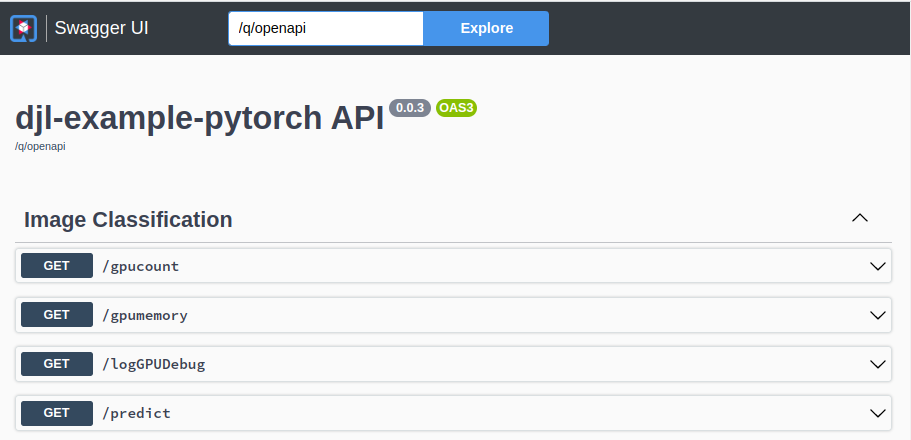

:scrollbar:
:data-uri:
:toc2:
:linkattrs:


= DJL on Quarkus Java

:numbered:

This project uses Quarkus, the _Supersonic Subatomic Java Framework_ as well as DJL, the _Deep Java Library_.

If you want to learn more about Quarkus, please visit its link:https://quarkus.io[website].

If you want to learn more about DJL, please visit its link:https://djl.ai[website]

== Overview
The project demonstrates serving of a deep learning _image classification_ application.
In particular, the application can predict the probability that a link:https://djl-ai.s3.amazonaws.com/resources/images/kitten_small.jpg[kitten] depicted in an image is some sub-species of the cat family.

To do so, the same link:https://github.com/redhat-na-ssa/djl-intro/blob/main/src/main/java/com/example/ImageClassification.java[simple app] can be powered (mostly via configuration) by various Deep learning frameworks (ie: Tensorflow, PyTorch, MXNet) as link:https://djl.ai/docs/engine.html#supported-engines[supported by DJL].

Once the app is running, you interact with it via its RESTful endpoints.



== Local
This application can run in your local environment.

=== Pre-reqs

. *GPU/CPU*
+
This app will auto-detect the presence of a GPU and utilize it if found.
Otherwise, the app will default to a CPU.
+
The app exposes various diagnostic related REST endpoints that provide insight as to the GPU/CPU it has found.

. *Network*
+
You'll need a reliable broadband network due to downloading of a large quantity of library dependencies.

. *JDK11* (or more recent)
+
ie: `dnf install java-latest-openjdk-devel`

. *maven*
+
ie: `dnf install maven`

. *cURL* (or similar http test utility)
+
ie: `dnf install curl`

=== Quarkus `dev mode`

The application can be run locally in quarkus `dev mode` (which enables live coding).

NOTE:  a GPU is not required to run the application.  If deep learning engine detects the presence of a GPU, then it will use it.  If not, the deep learning engine will default to CPUs.

. Seed the `maven wrapper`:
+
-----
$ mvn wrapper:wrapper
-----

. Run the application in quarkus `dev mode`` using any of the following deep learning engines:


.. *TensorFlow*
+
```
./mvnw quarkus:dev -Ptensorflow
```

.. *PyTorch*
+
-----
./mvnw quarkus:dev -Ppytorch
-----

.. *MXNet*
+
-----
./mvnw quarkus:dev -Pmxnet
-----

. View RESTful API exposed by app:
+
Open a browser tab and navigate to:  `localhost:8080/q/swagger-ui`


== Linux Containers

=== Pre-reqs:

. *podman*
+
ie:  `dnf install podman`

=== Packaging

Linux container images already exist in `quay.io`.
If you just want to leverage those existing linux containers, then you can skip this section.

. Using `podman` utility, log into `quay.io`
+
-----
$ podman login quay.io
-----

. *PyTorch*
+
-----
$ cp config/kube/openshift-pytorch.yml src/main/kubernetes/openshift.yml \
  && ./mvnw clean package \
            -Ppytorch \
            -Dquarkus.application.name=djl-example-pytorch \
            -DskipTests \
            -Dquarkus.container-image.build=true \
            -Dquarkus.container-image.push=true
-----

. *TensorFlow*
+
-----
$ cp config/kube/openshift-tensorflow.yml src/main/kubernetes/openshift.yml \
  && ./mvnw clean package \
            -Ptensorflow \
            -Dquarkus.application.name=djl-example-tensorflow \
            -DskipTests \
            -Dquarkus.container-image.build=true \
            -Dquarkus.container-image.push=true
-----

. *MXNet*
+
-----
$ cp config/kube/openshift-mxnet.yml src/main/kubernetes/openshift.yml \
  && ./mvnw clean package \
            -Pmxnet \
            -Dquarkus.application.name=djl-example-mxnet \
            -DskipTests \
            -Dquarkus.container-image.build=true \
            -Dquarkus.container-image.push=true
-----


=== Execution

. Set an environment variable that specifies one of the possible deep learning engines:
+
-----
$ djl_engine=pytorch
-----
+
NOTE:  Possible options are:  *pytorch*, *mxnet*, or *tensorflow*

. Run linux container using designated deep learning engine:
+
-----
$ podman run \
  -d \
  --rm \
  --name djl-intro-$djl_engine \
  -p 8080:8080 \
  -p 5005:5005 \
  -e JAVA_ENABLE_DEBUG="true" \
  quay.io/redhat_naps_da/djl-example-$djl_engine:0.0.3
-----

. View RESTful API exposed by app:
+
Open a browser tab and navigate to:  `localhost:8080/q/swagger-ui`

== OpenShift

=== Pre-reqs

. *OpenShift Container Platform*
.. Tested on OCP 4.12 beta  (but earlier versions should also work fine as well)
.. CPU:
+
Allow 1 cpu core for each deep learning engine deployed.
+
Currently not tested using a GPU.
.. RAM:
+
Allow 1Gb RAM for each deep learning engine deployed.

.. Storage:  no PVs needed

. *helm*
+
ie: `dnf install helm`

. *cURL* (or similar http test utility)
+
ie: `dnf install curl`

=== Procedure

==== Deploy

. Create a ConfigMap from the project's _application.properties_:
+
-----
$ oc create cm djl-example --from-file=config/application.properties
-----

. Deploy app powered by PyTorch:
+
-----
$ helm install djl-example-pytorch https://github.com/redhat-na-ssa/djl-intro/raw/main/helm/djl-example-pytorch-0.0.1.tar.gz
-----

. Deploy app powered by TensorFlow:
+
-----
$ helm install djl-example-tensorflow https://github.com/redhat-na-ssa/djl-intro/raw/main/helm/djl-example-tensorflow-0.0.1.tar.gz
-----

. Deploy app powered by Apache MXNet:
+
-----
$ helm install djl-example-mxnet https://github.com/redhat-na-ssa/djl-intro/raw/main/helm/djl-example-mxnet-0.0.1.tar.gz
-----

. Determine node that pod landed on:
+
-----
$ oc get pod \
    -l deploymentconfig=djl-example-pytorch \
    -o json \
    -n user1-services \
    | jq -r .items[0].spec.nodeName
-----
+
NOTE: The result should return the id of your GPU enabled node.

==== Test

. Check your routes:
+
-----
$ $ oc get route

NAME                     HOST/PORT                                                            PATH   SERVICES                 PORT   TERMINATION   WILDCARD
djl-example-mxnet        djl-example-mxnet-user1-services.apps.den-east12.ratwater.xyz        /      djl-example-mxnet        http                 None
djl-example-pytorch      djl-example-pytorch-user1-services.apps.den-east12.ratwater.xyz      /      djl-example-pytorch      http                 None
djl-example-tensorflow   djl-example-tensorflow-user1-services.apps.den-east12.ratwater.xyz   /      djl-example-tensorflow   http                 None
-----

. View RESTful API exposed by app:
+
Open a browser tab and navigate to the output of the following:
+
-----
/q/swagger-ui`
-----


== Future:  Linux Native 
You can create a native executable using: 

```baseh
# use PyTorch engine
./mvnw clean package -Pnative -Ppytorch

# use TensorFlow engine
./mvnw clean package -Pnative -Ptensorflow
```

Or, if you don't have GraalVM installed, you can run the native executable build in a container using: 

```
./mvnw clean package -Pnative -Ppytorch -Dquarkus.native.container-build=true
```

You can then execute your native executable with:
 
```
target/imageclassification-1.0.0-SNAPSHOT-runner

# Turn on tensorflow javacpp debug log 
target/imageclassification-1.0.0-SNAPSHOT-runner -Dorg.bytedeco.javacpp.logger.debug=true
```

If you want to learn more about building native executables, please consult https://quarkus.io/guides/building-native-image.

== Alternatives

. link:https://docs.djl.ai/docs/serving/index.html[DJL Serving]
+
DJL Serving is a high performance universal stand-alone model serving solution powered by DJL. It takes a deep learning model, several models, or workflows and makes them available through an HTTP endpoint.

. link:https://camel.apache.org/components/3.20.x/djl-component.html[Camel-DJL]

