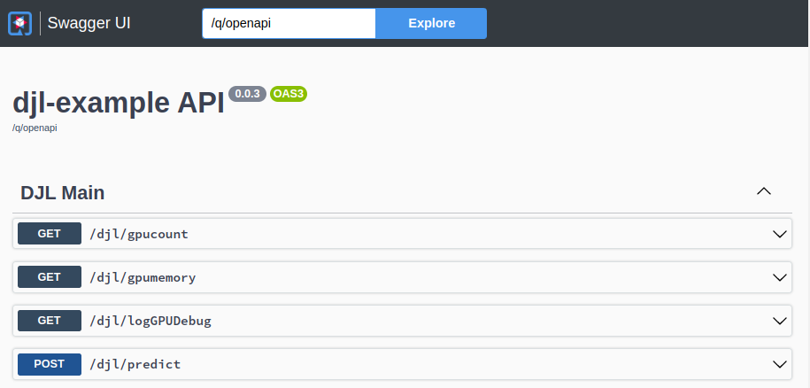

:scrollbar:
:data-uri:
:toc2:
:linkattrs:


= Cat Species Image Classification

:numbered:

== Overview
The project demonstrates serving of a deep learning _image classification_ application.
In particular, the application can predict the probability that a link:https://djl-ai.s3.amazonaws.com/resources/images/kitten_small.jpg[kitten] depicted in an image is some sub-species of the cat family.

To do so, the same app  can be powered (mostly via configuration) by various Deep Learning frameworks (ie: _Tensorflow_, _PyTorch_, _MXNet_) as link:https://djl.ai/docs/engine.html#supported-engines[supported by DJL].


Once the app is running, you interact with it via a RESTful API.



== Local
This application can run in your local environment.

=== Pre-reqs

. *GPU/CPU*
+
This app will auto-detect the presence of a GPU and utilize it if found.
Otherwise, the app will default to a CPU.
+
The app exposes various diagnostic related REST endpoints that provide insight as to the GPU/CPU it has found.

. *Network*
+
You'll need a reliable broadband network due to downloading of a large quantity of library dependencies.

. *JDK11* (or more recent)
+
ie: `dnf install java-latest-openjdk-devel`

. *maven*
+
ie: `dnf install maven`

. *cURL* (or similar http test utility)
+
ie: `dnf install curl`

. *DJL_CACHE_DIR*
+
DJL engines link:https://djl.ai/docs/development/cache_management.html[download models] and any needed C++ shared object files to a directory specified by the environment variable: `DJL_CACHE_DIR` .  
You are encouraged to set this environment variable in your shell.  
Otherwise, DJL will write these files to: `$HOME/.djl.ai`

=== Quarkus `dev mode`

The application can be run locally in quarkus `dev mode` (which enables live coding).

NOTE:  a GPU is not required to run the application.  If deep learning engine detects the presence of a GPU, then it will use it.  If not, the deep learning engine will default to CPUs.

. Seed the `maven wrapper`:
+
-----
$ mvn wrapper:wrapper
-----

. Run the application in quarkus `dev mode`` using any of the following deep learning engines:


.. *TensorFlow*
+
```
./mvnw quarkus:dev -Ptensorflow
```

.. *PyTorch*
+
-----
./mvnw quarkus:dev -Ppytorch
-----

.. *MXNet*
+
-----
./mvnw quarkus:dev -Pmxnet
-----

. View RESTful API exposed by app:
+
Open a browser tab and navigate to:  `localhost:8080/q/swagger-ui`


== Linux Containers

=== Pre-reqs:

. *podman*
+
ie:  `dnf install podman`

. *quay.io*
+
Linux container images already exist in `quay.io`.
If you want to push to quay.io, then authenticate as follows:
+
-----
$ podman login quay.io
-----


. To support link:https://github.com/deepjavalibrary/djl-serving/blob/master/serving/docs/configurations.md#djl-settings[off-line mode] of the DJL engines, a pre-seeded DJL cache will be mounted to the linux container.  
emporary directories and/or json files might be generated in this DJL cache.  
This DJL cache directory should be made writable by the container process for the following reasons:

.. Extraction of native C++ libraries included in DJL `fatjar` to $DJL_CACHE_DIR
.. Downloading of any models from DJL's ModelZoo that may be used by the application.

. Make $DJL_CACHE_DIR writable for container process:
+
-----
$ export DJL_CACHE_DIR_OCI=/u02/djl.ai.oci \
    && mkdir -p $DJL_CACHE_DIR_OCI

$ sudo semanage fcontext -a \
        -t container_file_t "$DJL_CACHE_DIR_OCI(/.*)?"

$ sudo restorecon -R $DJL_CACHE_DIR_OCI

$ podman unshare chown -R 185:185 $DJL_CACHE_DIR_OCI
-----

=== Image Classification

==== Create Linux Container

. Change directory into:  `djl-iclassification`

. Set an environment variable that specifies one of the possible deep learning engines:
+
-----
$ djl_engine=pytorch
-----
+
NOTE:  Possible options are:  *pytorch*, *mxnet*, or *tensorflow*

. Build container and generate openshift/helm configs:
+
-----
$ cp config/kube/openshift-$djl_engine.yml src/main/kubernetes/openshift.yml \
  && ./mvnw clean package \
            -P$djl_engine \
            -Dquarkus.application.name=djl-iclassification-$djl_engine \
            -DskipTests \
            -Dquarkus.container-image.build=true \
            -Dquarkus.container-image.push=true
-----


==== Execution

. Set an environment variable that specifies one of the possible deep learning engines:
+
-----
$ djl_engine=pytorch
-----
+
NOTE:  Possible options are:  *pytorch*, *mxnet*, or *tensorflow*

. Set environment variable indicating whether to run the DJL engine in offline mode:
+
-----
$ djl_offline=false
-----

. Run linux container using designated deep learning engine:
+
-----
$ podman run \
    --rm \
    --name djl-iclass-$djl_engine \
    -p 8080:8080 \
    -p 5005:5005 \
    -e JAVA_ENABLE_DEBUG="true" \
    -e JAVA_OPTS="-Dquarkus.http.host=0.0.0.0 -Djava.util.logging.manager=org.jboss.logmanager.LogManager -Doffline=$djl_offline" \
    -e DJL_CACHE_DIR=/mnt/djl.ai \
    -v $DJL_CACHE_DIR_OCI:/mnt/djl.ai:z \
    quay.io/redhat_naps_da/djl-iclassification-$djl_engine:0.0.3
-----

. View RESTful API exposed by app:
+
Open a browser tab and navigate to:  `localhost:8080/q/swagger-ui`


== OpenShift

=== Pre-reqs

. *OpenShift Container Platform*
.. Tested on OCP 4.12 beta  (but earlier versions should also work fine as well)
.. CPU:
+
Allow 1 cpu core for each deep learning engine deployed.
+
Currently not tested using a GPU.
.. RAM:
+
Allow 1Gb RAM for each deep learning engine deployed.

.. Storage:  no PVs needed

. *helm*
+
ie: `dnf install helm`

. *cURL* (or similar http test utility)
+
ie: `dnf install curl`

=== Procedure

==== Deploy

. Create a ConfigMap from the project's _application.properties_:
+
-----
$ oc create cm djl-iclassification --from-file=config/application.properties
-----

. Deploy app powered by PyTorch:
+
-----
$ helm install djl-iclassification-pytorch https://github.com/redhat-na-ssa/djl-intro/raw/main/helm/djl-iclassification-pytorch-0.0.1.tar.gz
-----

. Deploy app powered by TensorFlow:
+
-----
$ helm install djl-iclassification-tensorflow https://github.com/redhat-na-ssa/djl-intro/raw/main/helm/djl-iclassification-tensorflow-0.0.1.tar.gz
-----

. Deploy app powered by Apache MXNet:
+
-----
$ helm install djl-iclassification-mxnet https://github.com/redhat-na-ssa/djl-intro/raw/main/helm/djl-iclassification-mxnet-0.0.1.tar.gz
-----

. Determine node that pod landed on:
+
-----
$ oc get pod \
    -l deploymentconfig=djl-iclassification-pytorch \
    -o json \
    -n user1-services \
    | jq -r .items[0].spec.nodeName
-----
+
NOTE: The result should return the id of your GPU enabled node.

==== Test

. Check your routes:
+
-----
$ $ oc get route

NAME                     HOST/PORT                                                            PATH   SERVICES                 PORT   TERMINATION   WILDCARD
djl-iclassification-mxnet        djl-iclassification-mxnet-user1-services.apps.den-east12.ratwater.xyz        /      djl-iclassification-mxnet        http                 None
djl-iclassification-pytorch      djl-iclassification-pytorch-user1-services.apps.den-east12.ratwater.xyz      /      djl-iclassification-pytorch      http                 None
djl-iclassification-tensorflow   djl-iclassification-tensorflow-user1-services.apps.den-east12.ratwater.xyz   /      djl-iclassification-tensorflow   http                 None
-----

. View RESTful API exposed by app:
+
Open a browser tab and navigate to the output of the following:
+
-----
/q/swagger-ui`
-----

== TO-DO

. locate `synset.txt`
+
IOT do image classification, you will also ned the synset.txt which stores the classification class labels.
